# Form Designer React Application - Architecture Diagrams

This document contains Mermaid diagrams that visualize the architecture, flows, and structure of the Form Designer React Application.

---

## 1. System Architecture Diagram

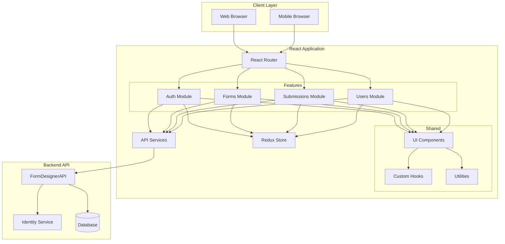

---

## 2. Authentication Flow Diagram

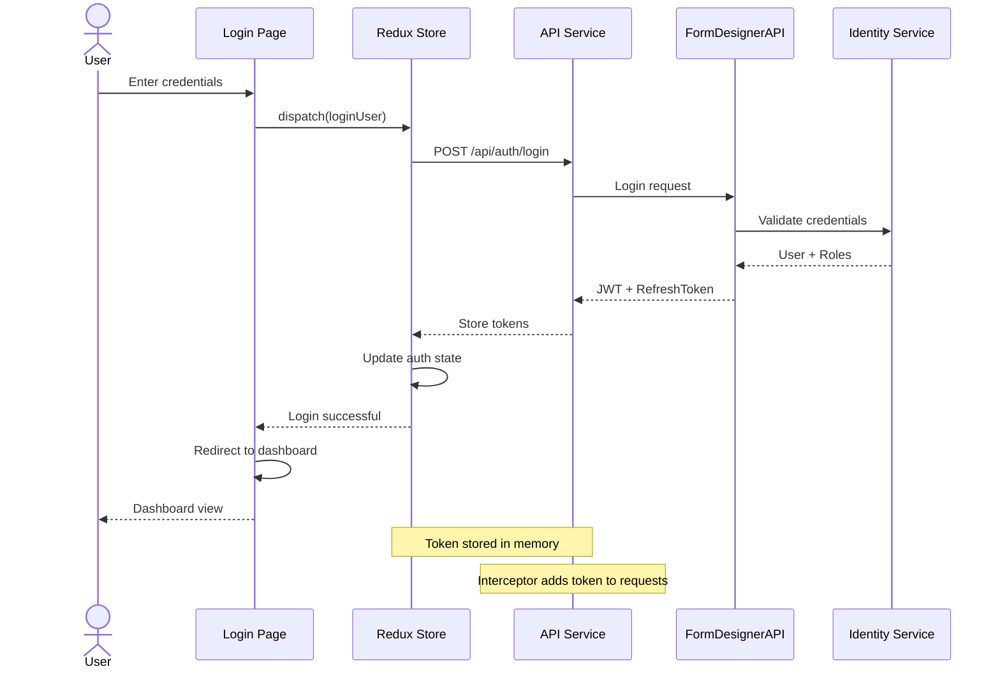

---

## 3. Token Refresh Flow

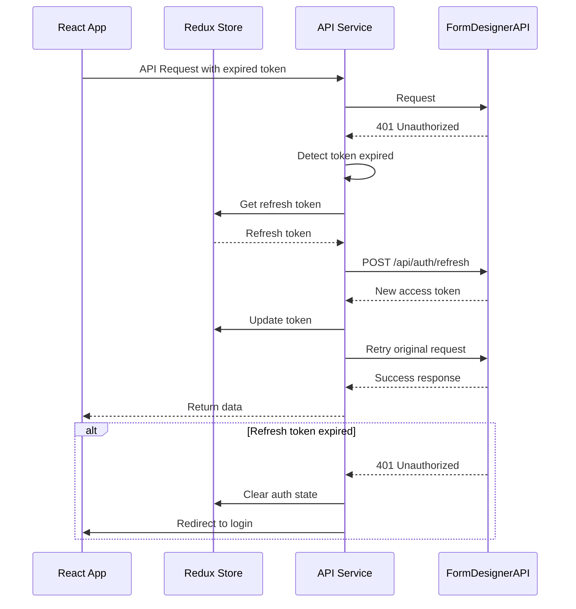

---

## 4. Form Builder Component Architecture

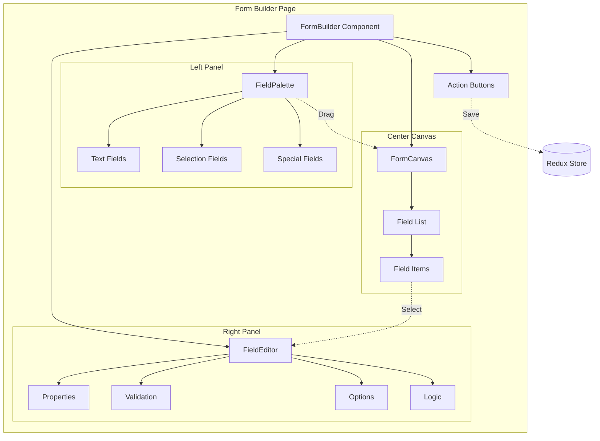

---

## 5. Redux State Structure

```mermaid
graph TB
    Root[Root State]
    
    Root --> Auth[auth]
    Root --> Forms[forms]
    Root --> Submissions[submissions]
    Root --> Users[users]
    Root --> UI[ui]
    
    Auth --> A1[user]
    Auth --> A2[token]
    Auth --> A3[isAuthenticated]
    Auth --> A4[isLoading]
    Auth --> A5[error]
    
    Forms --> F1[items]
    Forms --> F2[currentForm]
    Forms --> F3[isLoading]
    Forms --> F4[error]
    Forms --> F5[pagination]
    
    Submissions --> S1[items]
    Submissions --> S2[currentSubmission]
    Submissions --> S3[isLoading]
    Submissions --> S4[error]
    
    Users --> U1[items]
    Users --> U2[currentUser]
    Users --> U3[isLoading]
    Users --> U4[error]
    
    UI --> UI1[sidebarOpen]
    UI --> UI2[theme]
    UI --> UI3[notifications]
```

---

## 6. Form Submission Flow

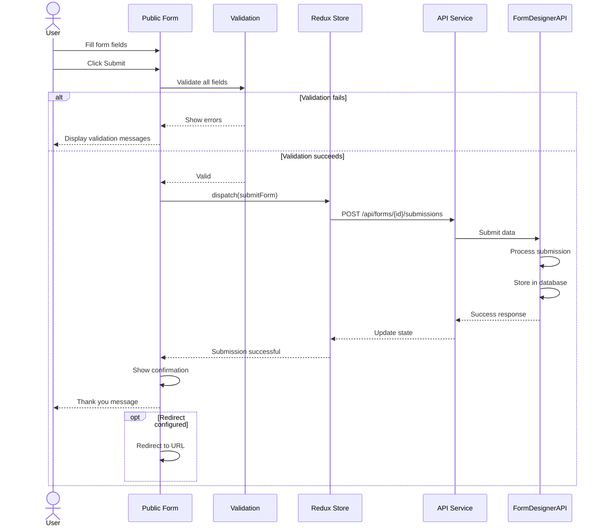

---

## 7. Role-Based Access Control Flow

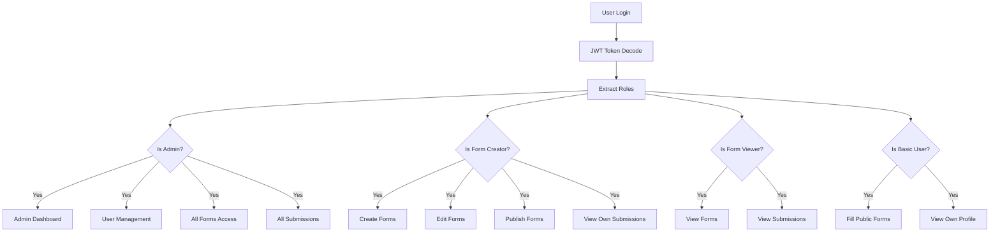

---

## 8. Component Hierarchy

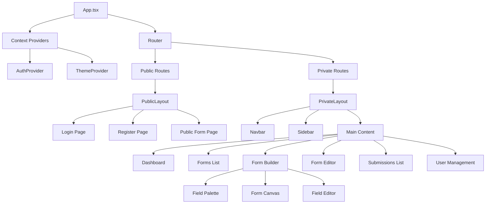

---

## 9. Data Flow Architecture

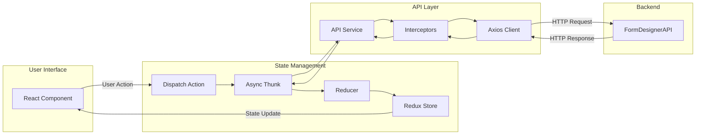

---

## 10. Deployment Architecture

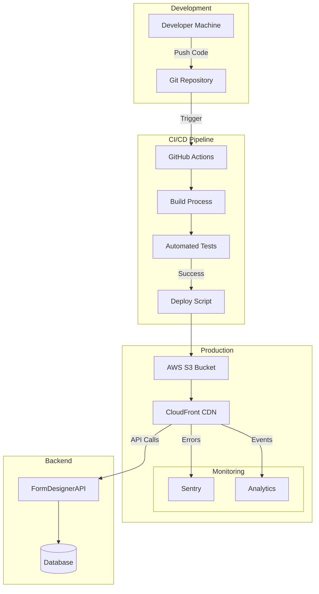

---

## 11. Feature Module Structure

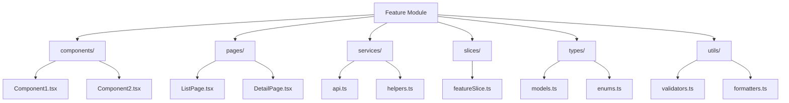

---

## 12. Error Handling Flow

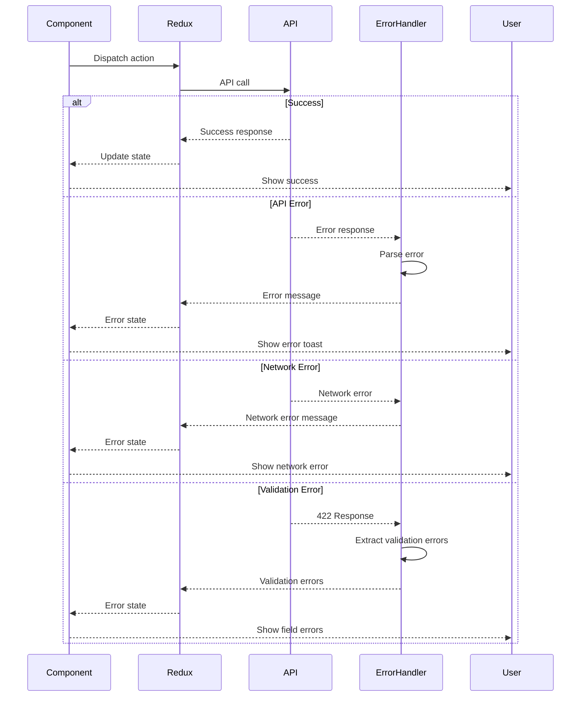

---

## 13. Form Builder State Machine

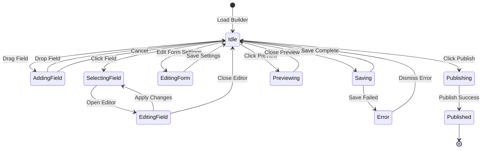

---

## 14. Testing Strategy Pyramid

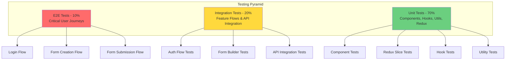

---

## 15. Performance Optimization Strategy

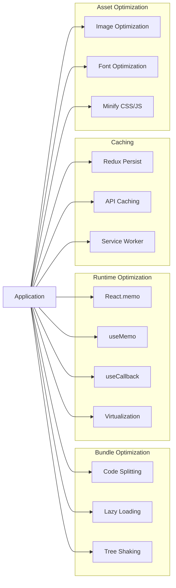

---

## 16. CI/CD Pipeline

```mermaid
graph LR
    subgraph "Development"
        Commit[Git Commit]
        Push[Git Push]
    end
    
    subgraph "Continuous Integration"
        Trigger[GitHub Actions]
        Install[Install Dependencies]
        Lint[Lint Code]
        Test[Run Tests]
        Build[Build Application]
    end
    
    subgraph "Quality Gates"
        Coverage[Check Coverage]
        Security[Security Scan]
        Performance[Performance Check]
    end
    
    subgraph "Continuous Deployment"
        Deploy[Deploy to Staging]
        Smoke[Smoke Tests]
        Prod[Deploy to Production]
    end
    
    Commit --> Push
    Push --> Trigger
    Trigger --> Install
    Install --> Lint
    Lint --> Test
    Test --> Build
    Build --> Coverage
    Coverage --> Security
    Security --> Performance
    Performance -->|Pass| Deploy
    Performance -->|Fail| Notify[Notify Team]
    Deploy --> Smoke
    Smoke -->|Pass| Prod
    Smoke -->|Fail| Rollback[Rollback]
```

---

## 17. Security Architecture

```mermaid
graph TB
    subgraph "Client Security"
        XSS[XSS Protection<br/>React Escaping]
        CSRF[CSRF Token]
        Input[Input Validation]
        HTTPS[HTTPS Only]
    end
    
    subgraph "Authentication"
        JWT[JWT Token]
        Refresh[Refresh Token]
        Expire[Token Expiration]
    end
    
    subgraph "Authorization"
        RBAC[Role-Based Access Control]
        Permissions[Permission Checks]
        Guards[Route Guards]
    end
    
    subgraph "Data Protection"
        Encrypt[Data Encryption]
        Sanitize[Input Sanitization]
        NoStore[No Sensitive Data in localStorage]
    end
    
    subgraph "API Security"
        CORS[CORS Policy]
        RateLimit[Rate Limiting]
        Headers[Security Headers]
    end
    
    App[React Application]
    
    App --> XSS
    App --> CSRF
    App --> Input
    App --> HTTPS
    App --> JWT
    App --> Refresh
    App --> Expire
    App --> RBAC
    App --> Permissions
    App --> Guards
    App --> Encrypt
    App --> Sanitize
    App --> NoStore
    
    API[FormDesignerAPI]
    
    App -.->|Secure Communication| API
    API --> CORS
    API --> RateLimit
    API --> Headers
```

---

These diagrams provide comprehensive visual representation of the Form Designer React Application architecture, flows, and design patterns. They can be rendered using any Mermaid-compatible tool or viewer.
