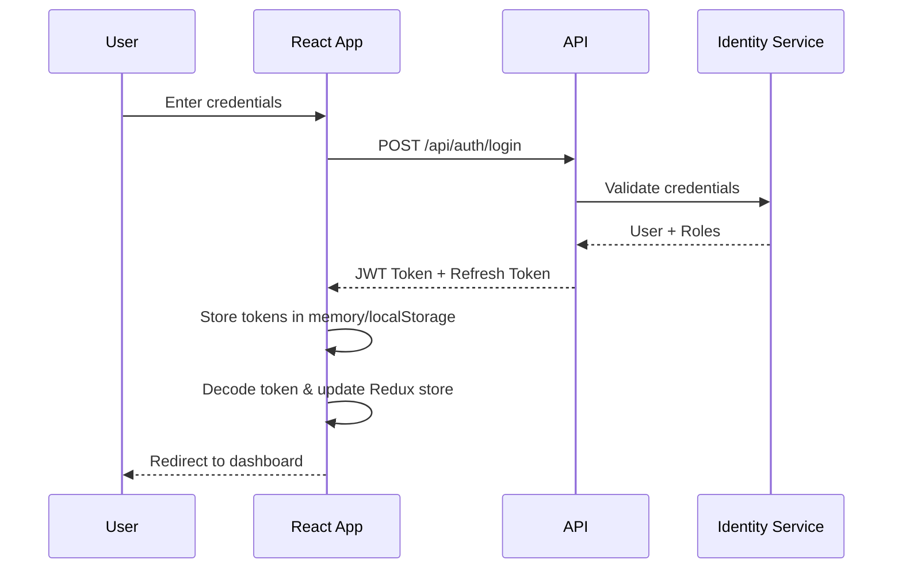

# Form Designer React Application - Solution Architecture Document

## 1. Executive Summary

This document outlines the architecture for a modern, enterprise-grade React application that interfaces with the FormDesignerAPI backend. The application will be built using TypeScript, React 18+, Redux Toolkit for state management, and React Bootstrap for UI components, with comprehensive JWT-based authentication and role-based access control.

---

## 2. System Overview

### 2.1 Purpose
The Form Designer React Application provides a user-friendly interface for creating, managing, and deploying dynamic forms. It connects to the FormDesignerAPI Clean Architecture backend to handle all business logic and data persistence.

### 2.2 Key Features
- **User Authentication & Authorization**: JWT token-based authentication with role-based access control (RBAC)
- **Form Management**: Create, edit, delete, and publish forms
- **Form Builder**: Drag-and-drop interface for form design
- **Form Submission**: Public-facing form filling and submission
- **User Management**: Admin interface for managing users and roles
- **Responsive Design**: Mobile-first, modern business styling
- **Real-time Validation**: Client-side and server-side validation
- **State Management**: Centralized Redux store with persistence

---

## 3. Technology Stack

### 3.1 Core Technologies
| Technology | Version | Purpose |
|------------|---------|---------|
| React | 18.3+ | UI framework |
| TypeScript | 5.3+ | Type safety and developer experience |
| Redux Toolkit | 2.0+ | State management |
| React Router | 6.20+ | Client-side routing |
| React Bootstrap | 2.9+ | UI component library |
| Axios | 1.6+ | HTTP client |
| Formik | 2.4+ | Form handling |
| Yup | 1.3+ | Schema validation |

### 3.2 Development Tools
- **Build Tool**: Vite 5.0+
- **Package Manager**: npm or yarn
- **Linting**: ESLint with TypeScript support
- **Formatting**: Prettier
- **Testing**: Jest + React Testing Library
- **E2E Testing**: Playwright or Cypress

---

## 4. Architecture Patterns

### 4.1 High-Level Architecture

```
┌─────────────────────────────────────────────────────────────┐
│                     React Application                        │
│  ┌───────────────────────────────────────────────────────┐  │
│  │                  Presentation Layer                    │  │
│  │  ┌──────────┐  ┌──────────┐  ┌──────────┐           │  │
│  │  │  Pages   │  │Components│  │  Layouts  │           │  │
│  │  └──────────┘  └──────────┘  └──────────┘           │  │
│  └───────────────────────────────────────────────────────┘  │
│  ┌───────────────────────────────────────────────────────┐  │
│  │               Application Layer                        │  │
│  │  ┌──────────┐  ┌──────────┐  ┌──────────┐           │  │
│  │  │  Redux   │  │  Hooks   │  │ Context  │           │  │
│  │  │  Store   │  │          │  │   API    │           │  │
│  │  └──────────┘  └──────────┘  └──────────┘           │  │
│  └───────────────────────────────────────────────────────┘  │
│  ┌───────────────────────────────────────────────────────┐  │
│  │                Infrastructure Layer                    │  │
│  │  ┌──────────┐  ┌──────────┐  ┌──────────┐           │  │
│  │  │   API    │  │  Local   │  │  Utils   │           │  │
│  │  │ Services │  │ Storage  │  │          │           │  │
│  │  └──────────┘  └──────────┘  └──────────┘           │  │
│  └───────────────────────────────────────────────────────┘  │
└─────────────────────────────────────────────────────────────┘
                            │
                            │ HTTPS + JWT
                            ▼
┌─────────────────────────────────────────────────────────────┐
│                    FormDesignerAPI                           │
│                  (Clean Architecture)                        │
└─────────────────────────────────────────────────────────────┘
```

### 4.2 Design Patterns

#### 4.2.1 Container/Presentational Components
- **Container Components**: Handle logic, data fetching, and state management
- **Presentational Components**: Pure UI components that receive data via props

#### 4.2.2 Feature-Sliced Design
Organize code by features rather than technical layers:
```
src/
├── features/
│   ├── auth/
│   ├── forms/
│   ├── users/
│   └── submissions/
```

#### 4.2.3 Redux Toolkit Patterns
- **Slices**: Feature-based state slices with reducers and actions
- **Async Thunks**: Handling asynchronous operations
- **RTK Query**: Efficient data fetching and caching (optional advanced feature)

#### 4.2.4 Custom Hooks Pattern
Encapsulate reusable logic in custom hooks:
- `useAuth()` - Authentication logic
- `useForm()` - Form handling
- `usePermissions()` - Role-based access control

---

## 5. Application Structure

### 5.1 Folder Structure

```
form-designer-app/
├── public/
│   ├── index.html
│   └── assets/
├── src/
│   ├── app/
│   │   ├── store.ts              # Redux store configuration
│   │   ├── rootReducer.ts        # Root reducer
│   │   └── hooks.ts              # Typed Redux hooks
│   ├── features/
│   │   ├── auth/
│   │   │   ├── components/
│   │   │   ├── pages/
│   │   │   ├── services/
│   │   │   ├── slices/
│   │   │   └── types/
│   │   ├── forms/
│   │   │   ├── components/
│   │   │   ├── pages/
│   │   │   ├── services/
│   │   │   ├── slices/
│   │   │   └── types/
│   │   ├── users/
│   │   └── submissions/
│   ├── shared/
│   │   ├── components/
│   │   │   ├── layout/
│   │   │   ├── ui/
│   │   │   └── forms/
│   │   ├── hooks/
│   │   ├── utils/
│   │   ├── types/
│   │   └── constants/
│   ├── services/
│   │   ├── api/
│   │   │   ├── client.ts         # Axios instance
│   │   │   ├── interceptors.ts   # Request/response interceptors
│   │   │   └── endpoints/
│   │   └── storage/
│   ├── routes/
│   │   ├── index.tsx             # Route configuration
│   │   ├── PrivateRoute.tsx      # Protected route wrapper
│   │   └── RoleRoute.tsx         # Role-based route wrapper
│   ├── styles/
│   │   ├── global.scss
│   │   ├── variables.scss
│   │   └── themes/
│   ├── App.tsx
│   ├── main.tsx
│   └── vite-env.d.ts
├── tests/
│   ├── unit/
│   ├── integration/
│   └── e2e/
├── .env.development
├── .env.production
├── tsconfig.json
├── vite.config.ts
├── package.json
└── README.md
```

---

## 6. Security Architecture

### 6.1 Authentication Flow



### 6.2 Token Management
- **Access Token**: Short-lived (15-60 minutes), stored in memory (Redux state)
- **Refresh Token**: Long-lived (7-30 days), stored in httpOnly cookie or secure localStorage
- **Automatic Refresh**: Implement token refresh before expiration
- **Token Revocation**: Handle logout and token invalidation

### 6.3 Role-Based Access Control (RBAC)

```typescript
enum UserRole {
  ADMIN = 'Admin',
  FORM_CREATOR = 'FormCreator',
  FORM_VIEWER = 'FormViewer',
  USER = 'User'
}

interface Permission {
  resource: string;
  actions: string[];
}

const rolePermissions: Record<UserRole, Permission[]> = {
  [UserRole.ADMIN]: [
    { resource: 'forms', actions: ['create', 'read', 'update', 'delete'] },
    { resource: 'users', actions: ['create', 'read', 'update', 'delete'] }
  ],
  [UserRole.FORM_CREATOR]: [
    { resource: 'forms', actions: ['create', 'read', 'update'] }
  ],
  // ... other roles
};
```

### 6.4 Security Best Practices
- **XSS Protection**: Sanitize user inputs, use React's built-in escaping
- **CSRF Protection**: Include CSRF tokens in state-changing requests
- **Secure Communication**: HTTPS only, secure headers
- **Input Validation**: Client-side and server-side validation
- **Sensitive Data**: Never store sensitive data in localStorage without encryption

---

## 7. State Management Architecture

### 7.1 Redux Store Structure

```typescript
interface RootState {
  auth: {
    user: User | null;
    token: string | null;
    isAuthenticated: boolean;
    isLoading: boolean;
    error: string | null;
  };
  forms: {
    items: Form[];
    currentForm: Form | null;
    isLoading: boolean;
    error: string | null;
    pagination: PaginationState;
  };
  users: {
    items: User[];
    currentUser: User | null;
    isLoading: boolean;
    error: string | null;
  };
  ui: {
    sidebarOpen: boolean;
    theme: 'light' | 'dark';
    notifications: Notification[];
  };
}
```

### 7.2 State Management Strategy
- **Redux Toolkit Slices**: Feature-based state management
- **Async Thunks**: Handle API calls with loading/error states
- **Context API**: For UI-specific state (theme, sidebar, etc.)
- **React Suspense**: Lazy loading and code splitting
- **Persistence**: Use `redux-persist` for auth state

---

## 8. API Integration

### 8.1 API Service Layer

```typescript
// services/api/client.ts
import axios from 'axios';

const apiClient = axios.create({
  baseURL: process.env.VITE_API_BASE_URL,
  headers: {
    'Content-Type': 'application/json'
  }
});

// Request interceptor - Add JWT token
apiClient.interceptors.request.use(
  (config) => {
    const token = store.getState().auth.token;
    if (token) {
      config.headers.Authorization = `Bearer ${token}`;
    }
    return config;
  },
  (error) => Promise.reject(error)
);

// Response interceptor - Handle token refresh
apiClient.interceptors.response.use(
  (response) => response,
  async (error) => {
    if (error.response?.status === 401) {
      // Handle token refresh or logout
    }
    return Promise.reject(error);
  }
);
```

### 8.2 API Endpoints (Assumed)
Based on Clean Architecture patterns, the API likely exposes:

- **Authentication**
  - `POST /api/auth/login`
  - `POST /api/auth/register`
  - `POST /api/auth/refresh`
  - `POST /api/auth/logout`
  - `GET /api/auth/me`

- **Forms**
  - `GET /api/forms`
  - `GET /api/forms/{id}`
  - `POST /api/forms`
  - `PUT /api/forms/{id}`
  - `DELETE /api/forms/{id}`
  - `POST /api/forms/{id}/publish`

- **Users** (Admin only)
  - `GET /api/users`
  - `GET /api/users/{id}`
  - `POST /api/users`
  - `PUT /api/users/{id}`
  - `DELETE /api/users/{id}`
  - `PUT /api/users/{id}/roles`

- **Submissions**
  - `POST /api/forms/{id}/submissions`
  - `GET /api/forms/{id}/submissions`
  - `GET /api/submissions/{id}`

---

## 9. Component Architecture

### 9.1 Component Hierarchy

```
App
├── AuthProvider (Context)
├── ThemeProvider (Context)
└── Router
    ├── PublicLayout
    │   ├── Header
    │   ├── Footer
    │   └── Pages (Login, Register, PublicForm)
    └── PrivateLayout
        ├── Navbar
        ├── Sidebar
        └── Pages
            ├── Dashboard
            ├── FormsList
            ├── FormBuilder
            ├── FormEditor
            ├── SubmissionsList
            └── UserManagement (Admin)
```

### 9.2 Key Components

#### 9.2.1 Form Builder Component
- Drag-and-drop interface using `react-beautiful-dnd` or `@dnd-kit/core`
- Field types: Text, Email, Number, Date, Select, Checkbox, Radio, File Upload
- Real-time preview
- Validation rules configuration
- Conditional logic support

#### 9.2.2 Authentication Components
- LoginForm
- RegisterForm
- ForgotPasswordForm
- ResetPasswordForm
- ProtectedRoute wrapper

#### 9.2.3 Shared UI Components
- Button, Input, Select (styled Bootstrap components)
- Modal, Alert, Toast
- LoadingSpinner
- ErrorBoundary
- DataTable with pagination

---

## 10. Routing Strategy

### 10.1 Route Configuration

```typescript
const routes = [
  // Public routes
  { path: '/', element: <HomePage /> },
  { path: '/login', element: <LoginPage /> },
  { path: '/register', element: <RegisterPage /> },
  { path: '/forms/:id/fill', element: <PublicFormPage /> },
  
  // Protected routes
  {
    path: '/app',
    element: <PrivateRoute><PrivateLayout /></PrivateRoute>,
    children: [
      { path: 'dashboard', element: <DashboardPage /> },
      { path: 'forms', element: <FormsListPage /> },
      { path: 'forms/new', element: <FormBuilderPage /> },
      { path: 'forms/:id/edit', element: <FormEditorPage /> },
      { path: 'forms/:id/submissions', element: <SubmissionsListPage /> },
      
      // Admin-only routes
      {
        path: 'users',
        element: <RoleRoute requiredRole="Admin"><UserManagementPage /></RoleRoute>
      }
    ]
  },
  
  // Fallback
  { path: '*', element: <NotFoundPage /> }
];
```

### 10.2 Navigation Guards
- **PrivateRoute**: Requires authentication
- **RoleRoute**: Requires specific role
- **RedirectIfAuthenticated**: Redirect logged-in users away from login

---

## 11. Performance Optimization

### 11.1 Strategies
- **Code Splitting**: React.lazy() and Suspense for route-based splitting
- **Memoization**: React.memo, useMemo, useCallback for expensive computations
- **Virtual Scrolling**: For large lists (react-window or react-virtualized)
- **Image Optimization**: Lazy loading, WebP format, responsive images
- **Bundle Analysis**: Regular analysis with Vite's bundle analyzer
- **Caching**: Redux state persistence, API response caching

### 11.2 Build Optimization
```javascript
// vite.config.ts
export default defineConfig({
  build: {
    rollupOptions: {
      output: {
        manualChunks: {
          vendor: ['react', 'react-dom', 'react-router-dom'],
          redux: ['@reduxjs/toolkit', 'react-redux'],
          ui: ['react-bootstrap', 'bootstrap']
        }
      }
    }
  }
});
```

---

## 12. Error Handling

### 12.1 Error Boundary Strategy
```typescript
class ErrorBoundary extends React.Component {
  componentDidCatch(error: Error, errorInfo: ErrorInfo) {
    // Log to error reporting service
    logErrorToService(error, errorInfo);
  }
  
  render() {
    if (this.state.hasError) {
      return <ErrorFallback />;
    }
    return this.props.children;
  }
}
```

### 12.2 API Error Handling
- Centralized error handling in API interceptor
- User-friendly error messages
- Retry logic for transient failures
- Offline detection and handling

---

## 13. Testing Strategy

### 13.1 Testing Pyramid
- **Unit Tests (70%)**: Components, hooks, utilities, Redux slices
- **Integration Tests (20%)**: Feature flows, API integration
- **E2E Tests (10%)**: Critical user journeys

### 13.2 Testing Tools
```typescript
// Example test
describe('LoginForm', () => {
  it('should submit form with valid credentials', async () => {
    const mockLogin = jest.fn();
    render(<LoginForm onSubmit={mockLogin} />);
    
    await userEvent.type(screen.getByLabelText(/email/i), 'user@example.com');
    await userEvent.type(screen.getByLabelText(/password/i), 'password123');
    await userEvent.click(screen.getByRole('button', { name: /login/i }));
    
    expect(mockLogin).toHaveBeenCalledWith({
      email: 'user@example.com',
      password: 'password123'
    });
  });
});
```

---

## 14. Deployment Architecture

### 14.1 Build Process
```bash
npm run build
# Generates optimized production build in /dist
```

### 14.2 Deployment Options
- **Static Hosting**: Netlify, Vercel, AWS S3 + CloudFront
- **Container**: Docker container with Nginx
- **CDN**: CloudFlare, AWS CloudFront for global distribution

### 14.3 Environment Configuration
```env
# .env.production
VITE_API_BASE_URL=https://api.formdesigner.com
VITE_APP_NAME=Form Designer
VITE_TOKEN_REFRESH_INTERVAL=840000 # 14 minutes
```

---

## 15. Monitoring & Logging

### 15.1 Application Monitoring
- **Error Tracking**: Sentry or similar service
- **Performance Monitoring**: Web Vitals, Lighthouse CI
- **User Analytics**: Google Analytics or PostHog

### 15.2 Logging Strategy
```typescript
const logger = {
  info: (message: string, meta?: object) => {
    console.log(`[INFO] ${message}`, meta);
    // Send to logging service
  },
  error: (message: string, error?: Error) => {
    console.error(`[ERROR] ${message}`, error);
    // Send to error tracking service
  }
};
```

---

## 16. Accessibility (A11y)

### 16.1 Compliance
- **WCAG 2.1 Level AA** compliance
- Semantic HTML
- ARIA labels and roles
- Keyboard navigation
- Screen reader support

### 16.2 Testing
- Automated testing with jest-axe
- Manual testing with screen readers
- Lighthouse accessibility audits

---

## 17. Internationalization (Future)

### 17.1 i18n Setup (Optional for Phase 2)
```typescript
import i18n from 'i18next';
import { initReactI18next } from 'react-i18next';

i18n
  .use(initReactI18next)
  .init({
    resources: {
      en: { translation: enTranslations },
      es: { translation: esTranslations }
    },
    lng: 'en',
    fallbackLng: 'en'
  });
```

---

## 18. Development Workflow

### 18.1 Git Workflow
- **main**: Production-ready code
- **develop**: Integration branch
- **feature/***: Feature branches
- **hotfix/***: Production fixes

### 18.2 Code Quality
- Pre-commit hooks with Husky
- ESLint + Prettier
- TypeScript strict mode
- Unit test coverage > 80%

---

## 19. Documentation Requirements

### 19.1 Technical Documentation
- API integration guide
- Component library documentation (Storybook)
- Redux state management guide
- Deployment guide

### 19.2 User Documentation
- User manual
- Admin guide
- Form builder tutorial
- API documentation for form submissions

---

## 20. Risk Assessment & Mitigation

### 20.1 Identified Risks
| Risk | Impact | Probability | Mitigation |
|------|--------|-------------|------------|
| API changes breaking the UI | High | Medium | Comprehensive API versioning, integration tests |
| Security vulnerabilities | High | Low | Regular security audits, dependency updates |
| Performance issues with large forms | Medium | Medium | Virtualization, optimization, lazy loading |
| Browser compatibility | Low | Low | Use modern build tools, polyfills, browser testing |

---

## 21. Future Enhancements

### 21.1 Phase 2 Features
- Real-time collaboration on form building
- Advanced form analytics and reporting
- Webhook integrations
- White-labeling support
- Mobile application (React Native)
- AI-powered form suggestions

### 21.2 Technical Improvements
- Micro-frontend architecture
- GraphQL integration
- Server-side rendering (Next.js)
- Progressive Web App (PWA) features
- Advanced caching with Service Workers

---

## 22. Conclusion

This architecture provides a solid foundation for a modern, scalable, and maintainable React application. The use of TypeScript, Redux Toolkit, and React Bootstrap ensures type safety, predictable state management, and a professional UI. The modular structure allows for easy feature additions and team collaboration.

### 22.1 Success Criteria
- ✅ Successful authentication and authorization
- ✅ Intuitive form builder interface
- ✅ Responsive design across devices
- ✅ <3s page load time
- ✅ >80% test coverage
- ✅ WCAG 2.1 AA compliance

### 22.2 Timeline Estimate
- **Phase 1** (Foundation): 4-6 weeks
- **Phase 2** (Core Features): 6-8 weeks
- **Phase 3** (Polish & Testing): 2-3 weeks
- **Total**: 12-17 weeks

---

## Document Control

| Version | Date | Author | Changes |
|---------|------|--------|---------|
| 1.0 | 2025-12-15 | Development Team | Initial architecture document |

